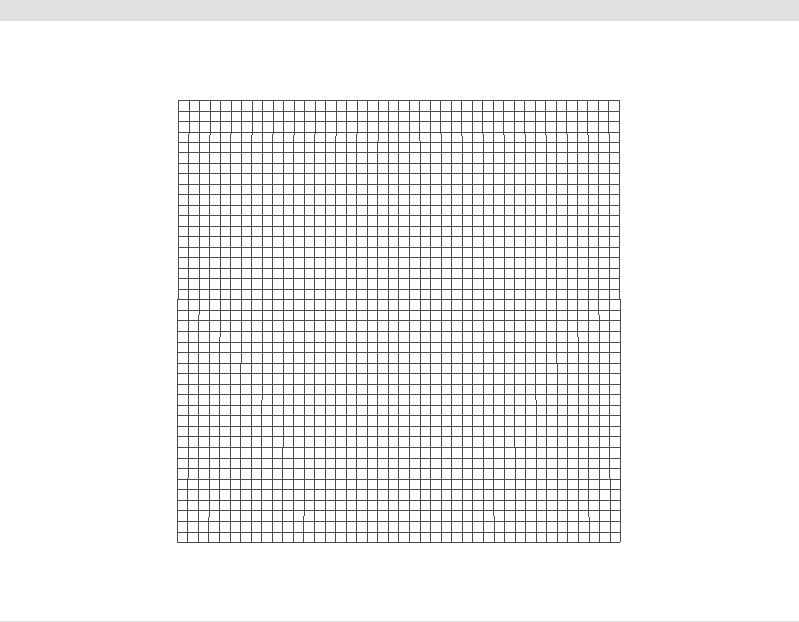

# mem3d



mem3d is a 3D visualization tool for memory allocation patterns.

mem3d runs a target program as a child process and uses a LD_PRELOAD hook to intercept the child process malloc and free calls, recording their timestamps, size, and addresses. These events are then interpolated across an animation timeline and rendered as an animated 3D grid, where each cell represents a single byte of memory.

the result is a fully interactive 3D visualization of a program’s dynamic memory behavior.

## dependencies

mem3d uses the following third party dependencies:

* [CMake](https://cmake.org/)
* [glad](https://github.com/Dav1dde/glad)
* [linmath](https://github.com/datenwolf/linmath.h)

## environment

mem3d was developed using WSL 2.6.1.0 (Ubuntu 22.04.5) with CMake 3.22.1 running gcc 11.4.0

to run mem3d on Windows, you'll need a unix environment such as [MSYS2](https://www.msys2.org/).

## getting started

first, make sure CMake is installed

```sh
$ sudo apt install cmake
```

clone mem3d

```sh
$ git clone https://github.com/sappqa/mem3d.git
```

create the build output directory

```sh
$ cd mem3d
$ mkdir build
```

compile mem3d

```sh
$ cd build
$ cmake ..
$ make
```

run mem3d

```sh
$ ./mem3d examples/ex_linked_lists
```

this runs the program `examples/ex_linked_lists` under mem3d, intercepting its memory activity and rendering it.

## controls

* 3D rotation - left-click/drag
* zoom - scroll wheel
